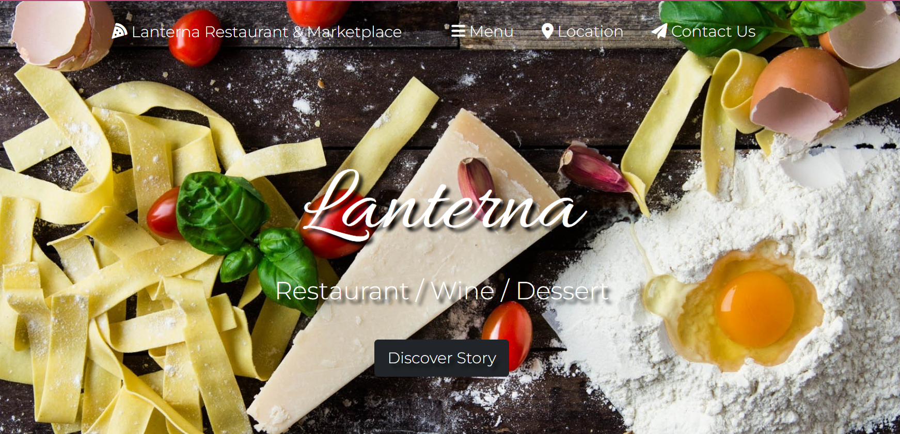
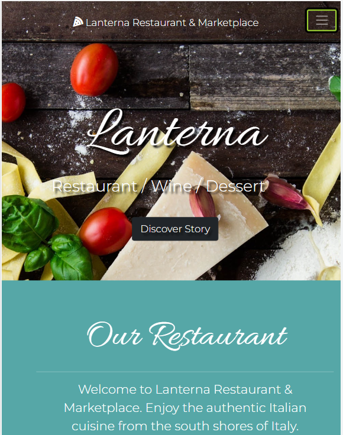

 
  # Lanterna app

  # Table of Contents
  _________________________________

[Description](#Description)

[Installations](#Installations)

[Usage](#Usage)

[Credits](#Credits)

[License](#License)

[Test](#Test)

[Questions](#Questions)
 

  # Description
   It is a website that contains the information of an Italian Restaurant, with navbar, menu, map to find the location of the restaurant and phone number to contact them and order food to pick-up.

  # Installation
  none

  # Usage
  You only have to click in the link below to be able to see the site in the browser or your phone:
  [Lanterna|Restaurant and Marketplace](https://lanterna-app.herokuapp.com/index.html#)

  # Credits
    none

  # License
  
  
  # Test
    none

  # Questions
  _________________________________

  ## If you have any further questions about this project, you can always contact me here:

  ## Name
  Fabiola C. Gamboa

  ## [Github](https://github.com/Fabscg)
  

  ## [Email](fabiscg79@gmail.com)

  ## 

  ## 

  
